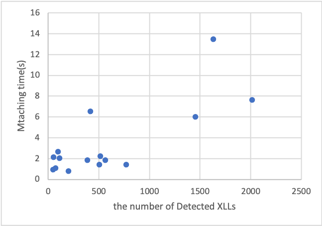

# Supplementary Material of *RQ3: the Evaluation of Efficiency*
We are going to analyse what effects the performance of **Focus** here.
We picked several properties of repositories to see whether they are related to the running time, including the number of files, LOC(lines of code), XLLs and config rules.

## Selected Repositories
We selected 15 repositories across 3 frameworks to evaluate the performance of **Focus**, which is the same as the setup of RQ2.

The repositories are:
| Android | SpringMVC | Mybatis |
| :--: | :--: | :--: |
| [TeamNewPipe/NewPipe](https://github.com/TeamNewPipe/NewPipe) | [shuzheng/zheng](https://github.com/shuzheng/zheng) | [macrozheng/mall](https://github.com/macrozheng/mall) |
| [CarGuo/GSYVideoPlayer](https://github.com/CarGuo/GSYVideoPlayer) | [saysky/ForestBlog](https://github.com/CarGuo/GSYVideoPlayer) | [jeecgboot/jeecg-boot](https://github.com/jeecgboot/jeecg-boot) |
| [android-hacker/VirtualXposed](https://github.com/android-hacker/VirtualXposed) | [spring-io/sagan](https://github.com/spring-io/sagan) | [shuzheng/zheng](https://github.com/shuzheng/zheng)     |
| [youlookwhat/CloudReader](https://github.com/youlookwhat/CloudReader)   | [xubinux/xbin-store](https://github.com/xubinux/xbin-store) | [newbee-ltd/newbee-mall](https://github.com/newbee-ltd/newbee-mall)   | 
| [rovo89/XposedInstaller](https://github.com/rovo89/XposedInstaller) | [jeecgboot/jeecg](https://github.com/jeecgboot/jeecg) | [codedrinker/community](https://github.com/codedrinker/community) |
## Properties
| Repo |Files | LOC | Detected XLLs | Config Rules |
| :--: | :--: | :--: | :--: | :--: |
| TeamNewPipe/NewPipe | 762 | 114817 | 1454 | 11 |
| CarGuo/GSYVideoPlayer | 378 | 50827 | 769 | 11 |
| android-hacker/VirtualXposed | 611 | 62941 | 70 | 11 |
| youlookwhat/CloudReader | 378 | 33058 | 565 | 11 |
| rovo89/XposedInstaller | 191 | 18585 | 201 | 11 |
| shuzheng/zheng | 533 | 55707 | 52 | 44 |
| saysky/ForestBlog | 139 | 13758 | 47 | 44 |
| spring-io/sagan | 281 | 24102 | 112 | 44 |
| xubinux/xbin-store  | 670 | 293086 | 94 | 44 |
| jeecgboot/jeecg | 1034 | 176128 | 514 | 44 |
| macrozheng/mall | 634 | 108176 | 1631 | 61 |
| jeecgboot/jeecg-boot | 703 | 66485 | 416 | 61 |
| shuzheng/zheng | 699 | 70538 | 2016 | 61 |
| newbee-ltd/newbee-mall | 98  | 9546  | 385 | 61 |
| codedrinker/community | 97 | 15651 | 506 | 61 |
### Files
The number of files to be parsed intuitively affect the performance of code parsing since the unit of the input to parsers is source files. The parsers process the whole repo by parsing every source file related to framework-specific XLL extraction.

It should be noted that we only count in the files which are going to be parsed in the process of XLL extraction. For example, the repo *shuzheng/zheng* is an Android project and a SpringMVC project at the same time, so the number of files is different when it's viewed as a project of different frameworks (as an Android project, we only count in JAVA and XML files, while as a SpringMVC we only count in JAVA and HTML/JSP files).
### LOC
LOC (Lines Of Code), may have great impact on the performance of parsers since a repo may contain more code elements such as statements and identifiers if its LOC is higher, thus burdening the parsers with more work to do.

We calculated LOC of a repository by traversing each files which are to be parsed afterwards to extract URIs, summing up the number of code lines of these files.
### Detected XLLs
The number of XLLs may affect the performance of XLL matching since the matcher matches related cross-lang identifiers according to defined rules to get XLLs. The more XLLs the repo contains, the higher consumption is devoted to the processing and matching of URIs.
### Config Rules
The number of config rules may affect the performance of XLL matching because we extract XLLs according to config rules. **Focus** traverses each config rule to determine whether there are identifiers to be matched considering this certain rule. So the number of config rules (and also the complexity of these rules) can influence the matching time of XLL extraction.
## The Results of Running Time
| Repo | Total(ms) | Parsing(ms) | Matching(ms) | Matching/Total|
| :--: | :--: | :--: | :--: | :--: |
| TeamNewPipe/NewPipe | 36729 | 30702 | 6027 | 16.41% |
| CarGuo/GSYVideoPlayer | 18215 | 16792 | 1423 | 7.81% |
| android-hacker/VirtualXposed | 38716 | 37615 | 1101 | 2.84% |
| youlookwhat/CloudReader   | 15603 | 13759 | 1844 | 11.82% |
| rovo89/XposedInstaller | 3902 | 3110 | 792 | 20.3% |
| shuzheng/zheng | 37246 | 35119 | 2127 | 5.71% | 533 |
| saysky/ForestBlog | 3414 | 2486 | 928 | 27.18% |
| spring-io/sagan | 8555 | 6534 | 2021 | 23.62% |
| xubinux/xbin-store  | 20236 | 17558 | 2678 | 13.23% |
| jeecgboot/jeecg | 236998 | 234743 | 2255 | 0.95% |
| macrozheng/mall | 299894 | 286445 | 13449 | 4.48% |
| jeecgboot/jeecg-boot | 55929 |  49378 | 6551 | 11.71% |
| shuzheng/zheng     | 45548 | 37930 | 7618 | 16.73% |
| newbee-ltd/newbee-mall   | 8936  | 7088 | 1848 | 20.68% |
| codedrinker/community | 7795 | 6376 | 1419 | 18.20% |

The running time in most of the cases is satisfying (under 1 min), while still the total time of XLL extraction on several repos is high, namely *jeecg* and *mall*, reaching 237s and 300s respectively.

More speccifically, the parsing time is the major overhead in XLL extraction, while the matching time usually takes up a small proportion of less than 20%, at an average of 13.45%. The matching time is mostly under 10s, which means that the performance of the matching algorithm is satisfying.

We can notice that the repos on which the time consumption of XLL extraction is much higher than the others have large number of files and large LOC. Since the size of the source code may increase the parsing time greatly, it is par for the course.

Also, we can see relevance between the matching time and the number of the detected XLLs of the repos.

As the above graph shows, the more XLLs are detected, there is more possibility that the matching time can be high.

The number of config rules also shows an impact on the performance of XLL matching. The number of config rules for the three frameworks is respectively 11, 44 and 61 (Android < SpringMVC < Mybatis). Except for the repo *NewPipe* with much more detected XLLs than the other ones, SpringMVC repos need more matching time than Android repos at average. And Mybatis repos need more matching time than SpringMVC repos when they have nearly the same number of detected XLLs.

In conclusion, the number of files, LOC, detected XLLs and config rules together affect the running time of XLL extraction.